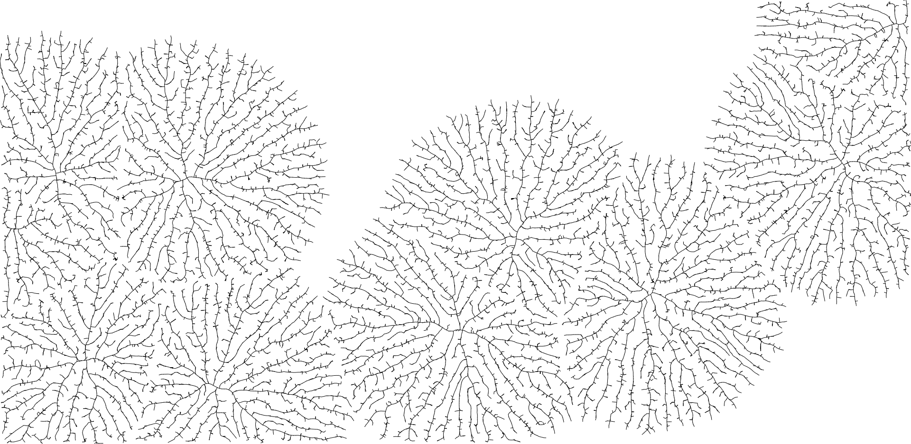
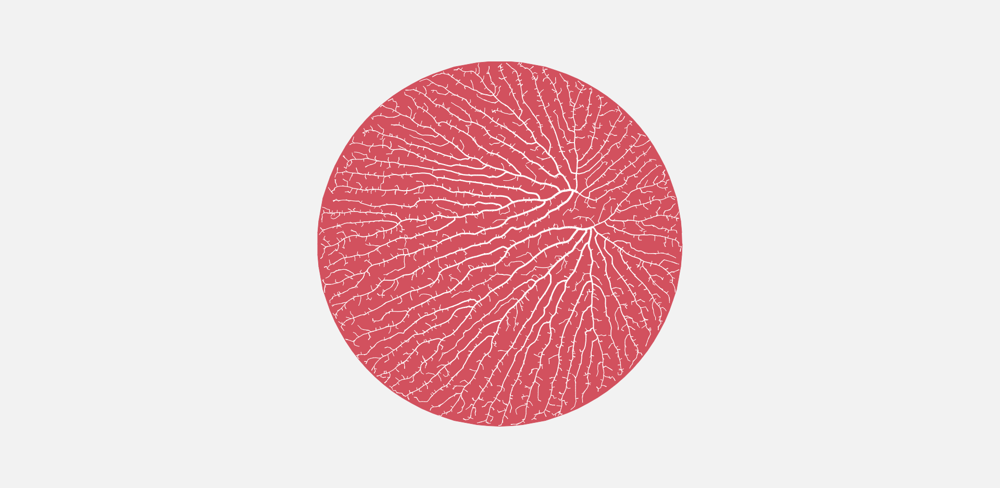
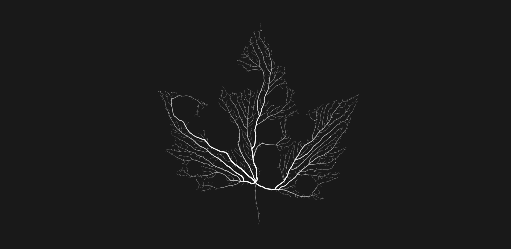
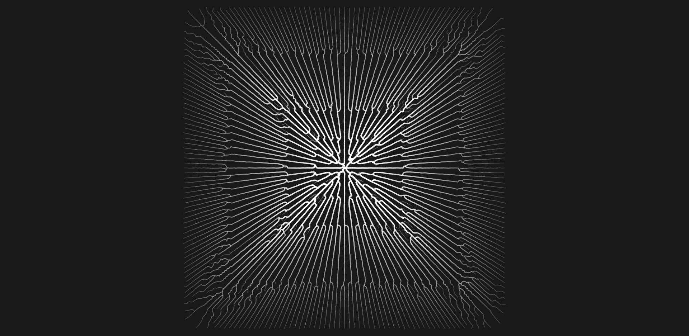

> [Read my Medium article](https://medium.com/@jason.webb/space-colonization-algorithm-in-javascript-6f683b743dc5) to learn more about the space colonization algorithm and this project.
>
> [Additional media is available on my portfolio](https://jasonwebb.io/2020/03/space-colonization-branching-experiments-in-javascript/)

## About space colonization

Space colonization is a process for iteratively growing networks of branching lines based on the distribution of growth hormone sources (called "auxin" sources) to which the lines are attracted. [Originally described](http://algorithmicbotany.org/papers/venation.sig2005.pdf) (PDF) by Adam Runions and collaborators at the Algorithmic Botany group at the University of Calgary, this system can be used to simulate the growth of leaf venation patterns and tree-like structures, as well as many other vein-like systems like Gorgonian sea fans, circulatory systems, root systems, and more.

The original algorithm describes methods for generating both "open" (as seen in the example GIF) and "closed" venation networks, referring to whether or not secondary or tertiary branches connect together to form loops (or anastomoses).

### Algorithm at a glance:

For both the open and closed variants of this algorithm, begin by placing a set of points on the canvas representing sources of either the auxin growth hormone (as in leaves) or ambient nutrients (as in trees).

#### Open venation:

* Associate each attractor with the single closest node within a pre-defined attraction distance.
* For each node that is associated with at least one attractor, calculate the average direction towards them as a normalized vector and generate a new node that extends in that direction at a pre-defined segment length (by scaling the normalized direction vector by that length).
* Remove any attractors that have nodes within a pre-defined kill distance around it.

#### Closed venation:

* Associate each attractor with all of the nodes that are both within a pre-defined attraction distance and within the attractor's relative neighborhood.
* For each node that is associated with at least one attractor, calculate the average direction towards them as a normalized vector and generate a new node that extends in that direction at a pre-defined segment length (by scaling the normalized direction vector by that length).
* Remove any attractors that have been reached by all of their associated nodes.

#### Auxin flux canalization:
This is a process by which veins become thicker as they grow longer. The longer a vein gets, the more auxin flows through it ("flux"), causing veins to progressively thicken from their tips to their roots. "Canalization" references the process by which "canals" of water form.

* Give each branch segment a uniform default thickness to start with.
* Beginning at each terminal node (that is, segments with no child segments), traverse "upwards" through each parent node, adding their child node thickness to their own until you reach a root node (a segment with no parent segment).

## Features

1. Supports both _open_ and _closed_ venation. Configurable via `./core/Defaults.js` or a local `Setting.js` file.
2. Growth can be constrained within _bounding shapes_. See `./core/Path.js` and `./core/Network.js`.
3. _Obstacles_ can be defined that growth must avoid. See `./core/Path.js` and `./core/Network.js`.
4. Simple SVG files can be loaded and parsed into either "bounds" or "obstacle" paths. See `./core/SVGLoader.js`.
5. Attractors can be placed along the edges of paths, which can in turn be scaled and moved, in order to model _marginal growth_. See `./marginal-growth/js/entry.js`.
6. Multiple vein networks can be created (just add more than one "root" vein to kick off growth).
7. Veins can be progressively thickened as they grow using a process called _auxin flux canalization_. Press `c` in any sketch to toggle it.
8. Vein transparency can be smoothly blended from tip to root using _opacity blending_ (a variation of auxin flux canalization). Press `p` in any sketch to toggle it.
9. Vein networks can be exported using `e` at any time. However, these networks get so complex so quickly that this can easily cause your browser to freeze - use at your own risk!

## Implementation notes

See `./core` for common modules:
* `Attractor.js` - location of a single source of auxin growth hormone or other growth-promoting influence
* `Network.js` - manages the growth of nodes based on attractors and provided bounds and obstacles
* `Path.js` - arbitrary path consisting of points, used for either constraining growth ("bounds") or defining areas for growth to avoid ("obstacle").
* `AttractorPatterns.js` - functions for generating attractors arranged in various patterns (grids, noise, etc)
* `Node.js` - a single point in a branch

A couple additional helper modules are also included there:
* `KeyboardInteractions.js` - a structure for handling common keyboard commands that every sketch should have
* `Utilities.js` - small helper functions like `random` and `lerp`
* `ColorPresets.js` - collection of pre-made color palettes for use in `Defaults.js`
* `Defaults.js` - collection of global variables used for configuring the behavior and display of the algorithm
  * Any variable can be overridden on a per-sketch basis using a local `Setting.js` file
* `SVGLoader.js` - utility for loading and parsing simple SVG documents to create Paths

## Technologies used
* Native [Canvas API](https://developer.mozilla.org/en-US/docs/Web/API/Canvas_API), specifically the [CanvasRenderingContext2D](https://developer.mozilla.org/en-US/docs/Web/API/CanvasRenderingContext2D) interface, for all drawing
* Vanilla ES6 JavaScript
* Webpack build system with live-reloading dev server

## Packages used
* [KDBush](https://www.npmjs.com/package/kdbush) for KD-tree based spatial index
* [vec2](https://www.npmjs.com/package/vec2) for simple, fast 2D vector math
* [Webpack](https://webpack.js.org/) for modern JS (ES6) syntax, code modularization, bundling, and serving locally.

## Install and run notes
1. Run `npm install` to get all packages
2. Run `npm run serve` to start up Webpack and launch the application in a browser window

## References

### Articles and papers:

* [Modeling and visualization of leaf venation patterns](http://algorithmicbotany.org/papers/venation.sig2005.pdf) (PDF) paper by Adam Runions, Martin Fuhrer, Brendan Lane, Pavol Federl, Anne−Gaëlle Rolland−Lagan, and Przemyslaw Prusinkiewicz
* [Modeling Trees with a Space Colonization Algorithm](http://algorithmicbotany.org/papers/colonization.egwnp2007.large.pdf) (PDF) paper by Adam Runions, Brendan Lane, and Przemyslaw Prusinkiewicz
* [Procedurally Generated Trees with Space Colonization Algorithm in XNA C#](http://www.jgallant.com/procedurally-generating-trees-with-space-colonization-algorithm-in-xna/) by Jon Gallant
* [Part 26: Trees](http://www.sea-of-memes.com/LetsCode26/LetsCode26.html) by Michael Goodfellow
* [Hyphae](https://github.com/inconvergent/hyphae) (Python) by Anders Hoff (inconvergent) ([live examples and short writeup](https://inconvergent.net/generative/hyphae/))
* [Space Colonization Algorithm Part 1](https://bastiaanolij.blogspot.com/2014/12/space-colonization-algorithm-part-1.html) [[Part II](https://bastiaanolij.blogspot.com/2014/12/space-colonization-algorithm-part-2.html)] [[Part III](https://bastiaanolij.blogspot.com/2015/01/space-colonization-algorithm-part-3.html)] by Bastiaan Olij
* [Space colonization](https://github.com/jasonwebb/morphogenesis-resources#space-colonization) in Jason Webb's Morphogenesis Resources repo.

### Creative projects:

* [Hyphae](https://n-e-r-v-o-u-s.com/shop/line.php?code=8), [Xylem](https://n-e-r-v-o-u-s.com/shop/line.php?code=6), [Folium](https://n-e-r-v-o-u-s.com/blog/?p=3983) series by Nervous System
  * Also see their [Xylem Experiments and Improvements](https://n-e-r-v-o-u-s.com/blog/?p=1218) write-up
* [Bromeliad](https://n-e-r-v-o-u-s.com/shop/product.php?code=286) and [Calyx](https://n-e-r-v-o-u-s.com/shop/product.php?code=285&search=download) lamps by Nervous System
* [Space Colonization Experiments](https://www.youtube.com/watch?v=D9Z3jJ87kzg) by David Ferreira

### Code projects:

* [ofxSpaceColoinzation](https://github.com/edap/ofxSpaceColonization) add-on for openFrameworks
* [space-colonization](https://github.com/nicknikolov/space-colonization) (JavaScript) by Nick Nikolov
* [Dendrite](https://github.com/mattatz/Dendrite) (Unity) by mattatz
* [Grower](https://github.com/joesfer/Grower) (Maya plugin) by Jose Esteve
* [Venation](https://github.com/nielmclaren/Venation) (Processing) by Niel McLaren
* [hyphae](https://github.com/jblondin/hyphae) (Julia) by Jamie Blondin
* [hyphae](https://github.com/inconvergent/hyphae) and [hyphae_ani](https://github.com/inconvergent/hyphae_ani) by Anders Hoff (inconvergent)

### Videos:

* [Coding Challenge #17: Fractal Trees - Space Colonization](https://www.youtube.com/watch?v=kKT0v3qhIQY) by Daniel Shiffman ([Github repo](https://github.com/CodingTrain/website/tree/master/CodingChallenges/CC_017_SpaceColonizer) with source code for p5.js and Processing)
* [VEX in Houdini: Space Colonization](https://vimeo.com/231315378) (Houdini + VEX) by Entagma
  * [SCA-2.1](https://vimeo.com/252447953) variation by IQCoo with obstacle avoidance, increasing path widths, heat transfer visualization.

## Screenshots

